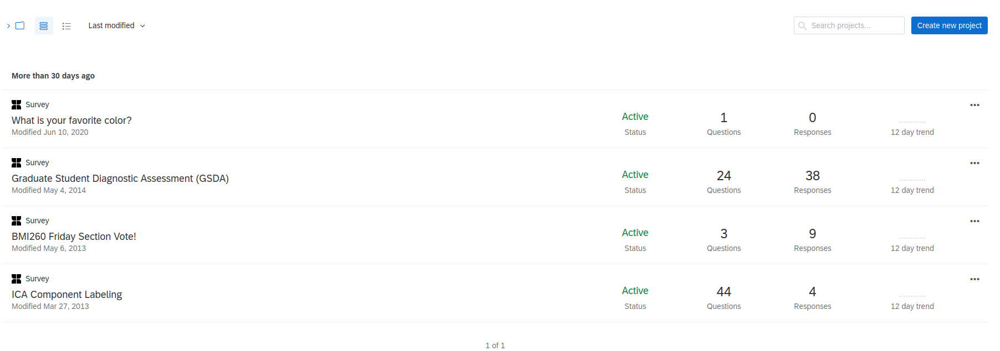
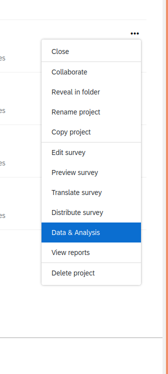
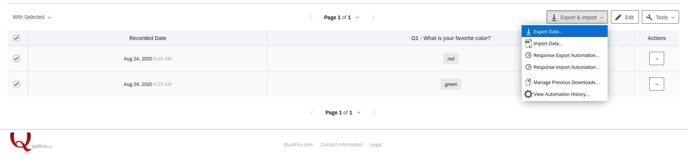
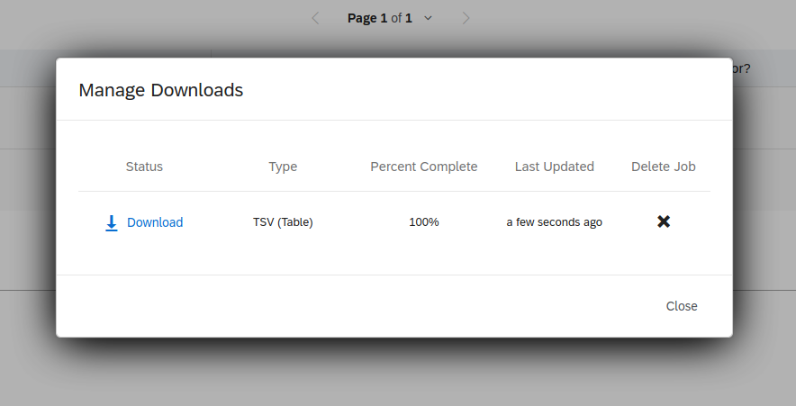
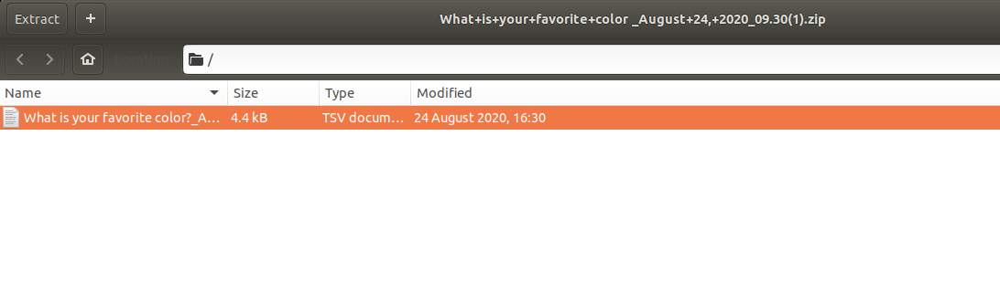
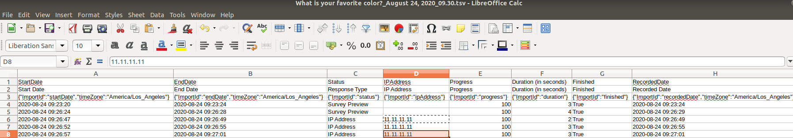

# Qualtrics Export

Stanford provides [Qualtrics](https://uit.stanford.edu/service/survey) for usage
for faculty, students, and staff. This set of instructions will walk through how to do
a manual (via the web interface) and automated export (via a Python script provided here).

## Manual Export

Once you log in to Qualtrics, you are presented with a screen of your projects.

If you click the ellipsis on the right for any project, one of the options is 
"Data and Analytics." Click this option.

You can then select all responses via the top checkbox "select all," and then click
on The export and Important button on the right and select to "Export Data."

There are many options for export! Likely you want some kind of delimited file (e.g.,
comma or dab delimited, csv and tsv respectively).

The interface will prepare your download, and then give you a button to click to start
it.

The download will typically be a compressed zip archive, which you can open with
extraction software and open the text file in a text editor, Google Sheets,
or Microsoft Excel equivalent.

Keep in mind that this data can have sensitive information like ip addresses,
and answers to questions that you've defined.

You generally want to keep it in a secure area and be conservative with who is given
access. Complete instructions from Qualtrics are [provided here](https://www.qualtrics.com/support/survey-platform/data-and-analysis-module/data/download-data/export-data-overview/).

## Python Export

**will be added shortly**
