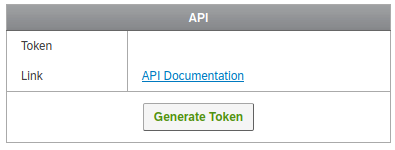

# Qualtrics Export

Stanford provides [Qualtrics](https://uit.stanford.edu/service/survey) for usage
for faculty, students, and staff. This set of instructions will walk through how to do
a manual (via the web interface) and automated export (via a Python script provided here).

## Manual Export

Once you log in to Qualtrics, you are presented with a screen of your projects.


If you click the ellipsis on the right for any project, one of the options is 
"Data and Analytics." Click this option.


You can then select all responses via the top checkbox "select all," and then click
on The export and Important button on the right and select to "Export Data."


There are many options for export! Likely you want some kind of delimited file (e.g.,
comma or dab delimited, csv and tsv respectively).

The interface will prepare your download, and then give you a button to click to start
it.


The download will typically be a compressed zip archive, which you can open with
extraction software and open the text file in a text editor, Google Sheets,
or Microsoft Excel equivalent.


Keep in mind that this data can have sensitive information like ip addresses,
and answers to questions that you've defined.


You generally want to keep it in a secure area and be conservative with who is given
access. Complete instructions from Qualtrics are [provided here](https://www.qualtrics.com/support/survey-platform/data-and-analysis-module/data/download-data/export-data-overview/).

## Python Export

It could be the case that you want a programmatic export, or your download is very
large and has issues being done manually. The script [download-qualtrics.py](download-qualtrics.py) 
will help you to download your data via the [Qualtrics API](https://www.qualtrics.com/community/discussion/6515/issue-in-the-downloaded-data-by-api). 

**Important** you must generate the API token using the same account that owns the survey! A shared survey with your API token will likely not work.

### 1. Request to Enable the API

The first thing to do is to open a [HelpSU Ticket](https://stanford.service-now.com/it_services?id=sc_cat_item&sys_id=46135c5a13bce2008a9175c36144b0a1)
and request that the Qualtrics API is enabled for your account. E.g.,

> I'd like to request to have the API enabled on my account (`[myusername]@stanford.edu`).

Once you receive confirmation that it's enabled, you can find the button to generate a token under
My Account (top right) --> Qualtrics IDs --> API.



Clicking the button will generate a token, which we will use next. I like to keep
the token in an .env file (which is already added to the Git Ignore so you won't
add to version control) 

```
#.env
export QUALTRICS_API_TOKEN=xxxxxxxxxxxxxx
```

And then I can source the file to have the variable in the environment.

### 2. Clone the repository.

Next, clone the repository:

```bash
git clone https://github.com/stanford-rc/qualtrics-download
cd qualtrics-download
```

Ensure that the script is executable:

```bash
chmod +x download-qualtrics.py
```

And if you haven't yet, export your token to the environment.

```bash
export QUALTRICS_API_TOKEN=xxxxxxxxxxxxxxxx
```

Note that you can also provide it via the `--api-token` command line parameter.

### 3. Create an output folder

It's good practice to keep your data organized, so you should next create
an output folder.

```bash
mkdir -p data/
```

### 4. Familarize with the script

You can then as for `--help` from the script to see all options and arguments.

```bash
$ python3 download-qualtrics.py --help
usage: download-qualtrics.py [-h] [--data-center {sjc1,iad1,ca1,fra1,syd1,gov1}] [--format {csv,tsv,xml}] [--survey-id SURVEY_ID] [--output-directory OUTPUT_DIR] [--api-token API_TOKEN]

Qualtrics Downloader

optional arguments:
  -h, --help            show this help message and exit
  --data-center {sjc1,iad1,ca1,fra1,syd1,gov1}
                        The data center to download from. Defaults to ca1.
  --format {csv,tsv,xml}
                        The export format. One of csv, tsv, or xml.
  --survey-id SURVEY_ID
                        The survey ID you want to download.
  --output-directory OUTPUT_DIR, -o OUTPUT_DIR
                        Output directory to download data. Defaults to present working directory.
  --api-token API_TOKEN
                        The Qualtrics API token. You can (and should) also export this to the environment as QUALTRICS_API_TOKEN
```

The only required argument is the survey id, because the default data center is the one used by Stanford,
we are okay with download of csv files, and the api token is exported to the environment. 
However we will also want to specify the output directory, since we don't want to export to
the present working directory but data/ instead.

### 5. Find your survey id

The survey id can be found in the same screen as the API token, which you might
still have open! It likely is a string with some prefix in the format `SV_beFvIwFCfli49vv`.
This is not a secret because it appears in the browser url (another place to find it). We would then
want to run the script as follows. This command will export a zip file of csv data for our
survey into the data/ folder.

```bash
python3 download-qualtrics.py --survey-id SV_beFvIwFCfli49vv -o data/
POST https://ca1.qualtrics.com/API/v3/responseexports/
GET https://ca1.qualtrics.com/API/v3/responseexports/ES_g9mafbokvu7atuip0f6bmui8gl
Download is 100.0% complete
GET https://ca1.qualtrics.com/API/v3/responseexports/ES_g9mafbokvu7atuip0f6bmui8gl/file
Unzipping to /home/vanessa/Desktop/Code/qualtrics-export/data...
Complete!
What is your favorite color.csv
```

You should then have your exported data file where you specified to download it.

```bash
ls data/
$ ls data/
'What is your favorite color.csv'
```

#### Options

 * `--survey-id`: is required. You can find it in the URL for the survey, or more explicitly under Account Settings -> Qualtrics Ids.
 * `--output-directory` or `-o`: should be the folder you want the zip file extracted to (with your export).
 * `--data-center`: Qualtrics stores data in different [data centers](https://api.qualtrics.com/api-reference/reference/responseImportsExports.json.). If you are in California, you can likely stay with the default (ca1) however you should visit the link to see other options.
 * `--format` The export format can be chosen from csv, tsv, and xml, as these are the most programmatically usable across platforms. It defaults to csv if you don't define it. You can read about other options [here](https://www.qualtrics.com/support/survey-platform/data-and-analysis-module/data/download-data/export-formats/) and note you'll need to update the choices in the script.
 * `--api-token` is more optimally exported to the environment, but you can define it as a command line argument too if this is more appropriate for your use case.

## Support

That's it! If you have any questions, please don't hesitate to [open an issue](https://github.com/stanford-rc/qualtrics-download/issues). If 
you need more specific help, either to interact with Qualtrics or further use your data, please don't
hesitate to reach out to [Research Software Engineering Services](https://stanford-rc.github.io/rse-services/support/).
